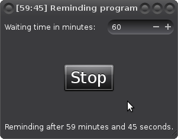

# GTK+ Reminder

This is a simple GTK+ 3 reminding application.

You can download, compile and run this with the following commands. You need
to have git, a make program, GTK+ 3 and a C compiler installed.

    $ git clone https://github.com/Akuli/gtk-reminder
    $ cd gtk-reminder
    $ make
    $ ./reminder

If you want to, you can install this program to `/usr/local` or uninstall
it easily:

    # make install
    # make uninstall

Or you can install or uninstall using a custom prefix:

    $ make PREFIX=~/my-prefix install
    $ make PREFIX=~/my-prefix uninstall
